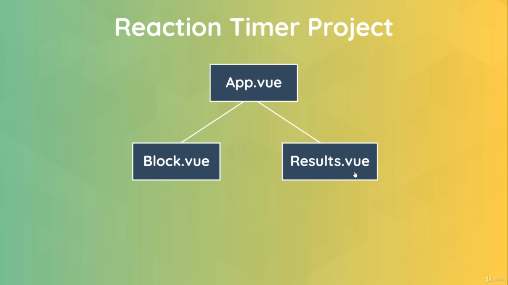

# Build Web Apps with Vue JS 3 & Firebase

## Chapter 1. Introducing and Setup

### 1.1. What is Vue?

- Frontend, Javascript/Typescript framework
- Used to create dynamic & data-driven websites (SPA's)
- Can also be used to create stand-alone widgets

### 1.2. Vue widgets

`Vue component`: Create a widget and drop it into multiple place in HTML

These widgets would be self-contained and all of the code and logic required to power that widget
would generally be inside of the view component itself.

### 1.3. Vue websites

- Vue is used to create a whole website with multiple pages & components
- These website are normally called Single Page Applications
- All routing is done in the browser & not on the server

### 1.4. Single Page Application (SPA)

- Only a single HTML page sent (initally) to the browser
- Vue intercepts subsequent requests and handles "page" changes in the browser by swapping what
  components are shown on the page
- Results in a much faster and smoother website experience

### 1.5. Vue 3 new features

#### The composition API

- Improves on reusability, organization & readability
- It does this by giving us a new `setup` function

#### Multiple root elements

- Can have many root elements side-by-side in a component

```js
<template>
  <div>First root element</div>
  <div>Second root element</div>
</template>
```

#### Teleport component

- Render content from one component in a different place in the DOM
- Useful for things like modals

#### Suspense component

- Used to handle asynchorous components easily
- Can provide fall-back content (e.g. a spinner) until data is loaded

#### Typescript support

- Can now write Vue application using Typescript

#### More changes

- Multiple `v-models` for custom components
- Improved reactivity
- Performance gains

### 1.5. Environment Setup

- VSCode

  - Live-server
  - Vetur

- [Source code](https://github.com/iamshaunjp/Vue-3-Firebase)

## Chapter 2: Vue Basics

Going to create a VueJS standalone component and inject it to static HTML page.

Install through CDN:

```html
< src="https://unpkg.com/vue@3.0.2"></script>
```

[VueJS documentation](https://v3.vuejs.org/guide/introduction.html)

Creating a Vue App

```html
<div id="app"></div>
```

```js
const app = Vue.createApp({
  template: '<h2>VueJS Template</h2>',
});

app.mount('#app');
```

Render dynamic data

```js
const app = Vue.createApp({
  data() {
    return {
      name: 'Trong Hieu',
    };
  },
});

app.mount('#app');
```

```html
<div id="app">Hello {{ name }}</div>
```

Methods and Click events

Using `v-on:[event]` directly on root template

```html
<div id="app">Hello {{ name }}</div>
<button v-on:click="name = 'Thi Ha'">Change name</button>
```

Using `@` symbol

```html
<div id="app">Hello {{ name }}</div>
<button @click="name = 'Thi Ha'">Change name</button>
```

Using a method

```html
<div id="app">Hello {{ name }}</div>
<button @click="changeName">Change name</button>
```

```js
const app = Vue.createApp({
  data() {
    return {
      name: 'Trong Hieu',
    };
  },
  methods: {
    changeName() {
      this.name = 'Thi Ha';
    },
  },
});

app.mount('#app');
```

Using a method with some given `args`

```html
<div id="app">Hello {{ name }}</div>
<button @click="changeName('Thi Ha')">Change name</button>
```

```js
const app = Vue.createApp({
  data() {
    return {
      name: 'Trong Hieu',
    };
  },
  methods: {
    changeName(name) {
      this.name = name;
    },
  },
});

app.mount('#app');
```

Conditional redering

```html
<div id="app">
  <div v-if="showName">
    <p>Hello {{ name }}</p>
  </div>

  <div>
    <button @click="toggleNameDisplay">
      <span v-if="showName">Hide Name</span>
      <span v-else>Show Name</span>
    </button>
  </div>

  <div v-show="showName">
    <p>Currently showing name</p>
  </div>
</div>
```

```js
const app = Vue.createApp({
  data() {
    return {
      showName: true,
      name: 'Trong Hieu',
    };
  },
  methods: {
    toggleNameDisplay() {
      this.showName = !this.showName;
    },
  },
});

app.mount('#app');
```

- `v-if`: If `false`, then remove completely the element from the DOM. And inject them into the DOM again when `true`
- `v-show`: Using `CSS` to show and hide element. `display: block` when showing, and `display: none` when hiding

Outputing a list

```js
const app = Vue.createApp({
  data() {
    return {
      books: [
        { title: 'Book 1', author: 'Author 1' },
        { title: 'Book 2', author: 'Author 2' },
        { title: 'Book 3', author: 'Author 3' },
      ],
    };
  },
});

app.mount('#app');
```

```html
<ul>
  <li v-for="item in books">
    <h3>{{ item.title }}</h3>
    <p>{{ item.author }}</p>
  </li>
</ul>
```

Attributes binding

Bind dynamic value to HTML attribute.

```js
const app = Vue.createApp({
  data() {
    return {
      url: 'https://dalatcoder.com',
    };
  },
});

app.mount('#app');
```

```html
<div>
  <a v-bind:href="url">Binding link</a>
</div>
<!-- The same at -->
<div>
  <a :href="url">Binding link</a>
</div>
```

```js
const app = Vue.createApp({
  data() {
    return {
      books: [
        { title: 'Book 1', author: 'Author 1', img: 'assets/1.jpg' },
        { title: 'Book 2', author: 'Author 2', img: 'assets/2.jpg' },
        { title: 'Book 3', author: 'Author 3', img: 'assets/3.jpg' },
      ],
    };
  },
});

app.mount('#app');
```

```html
<ul>
  <li v-for="item in books">
    
    <h3>{{ item.title }}</h3>
    <p>{{ item.author }}</p>
  </li>
</ul>
```

Dynamic classes

```js
const app = Vue.createApp({
  data() {
    return {
      books: [
        { title: 'Book 1', author: 'Author 1', img: 'assets/1.jpg', isFav = true },
        { title: 'Book 2', author: 'Author 2', img: 'assets/2.jpg', isFav = false },
        { title: 'Book 3', author: 'Author 3', img: 'assets/3.jpg', isFav = true },
      ],
    };
  },
});

app.mount('#app');
```

Class `fav` will be applied if `book.isFav` is `true`

```html
<ul>
  <li v-for="item in books" :class="{ fav: book.isFav }">
    
    <h3>{{ item.title }}</h3>
    <p>{{ item.author }}</p>
  </li>
</ul>
```

Computed properties

In a nutshell, a computed property is a way to define a data properties inside a component that depends on
another data on the same component.

E.g.: Define a `filteredBooks` array which depends on the original `books` array.

```js
const app = Vue.createApp({
  data() {
    return {
      books: [
        { title: 'Book 1', author: 'Author 1', img: 'assets/1.jpg', isFav = true },
        { title: 'Book 2', author: 'Author 2', img: 'assets/2.jpg', isFav = false },
        { title: 'Book 3', author: 'Author 3', img: 'assets/3.jpg', isFav = true },
      ],
    };
  },
  computed: {
    filteredBooks() {
      return this.books.filter(b => b.isFav);
    }
  }
});

app.mount('#app');
```

```html
<ul>
  <li v-for="item in filteredBooks">
    <h3>{{ item.title }}</h3>
    <p>{{ item.author }}</p>
  </li>
</ul>
```

## Chapter 3: The Vue CLI (for bigger projects)

- Use modern JavaScript features
- Provides us with a live-reload dev server
- Optimize our code for production

### 3.1. Environments

- `node -v`: 14.1.0
- `npm i @vue/cli`

Create new project

- `vue create modal-project`

### 3.2. Project Structure

- `public`: Contain initial `index.html`
- `src`: Contain all `components`, `templates` and `css`

  - `main.js`: Kick start the whole application

  ```js
  import { createApp } from 'vue';
  import App from './App.vue';

  createApp(App).mount('#app');
  ```

Every `vue` file represents a single view component.

Every component contains three different parts

- `<template>`: Contain `HTML` template
- `<script>`: Export the component object
- `<style>`: Any styles applied to the template

**Every component must at least have one template.**

```js
import HelloWorld from './components/HelloWorld.vue';

export default {
  name: 'App',
  components: {
    HelloWorld,
  },
};
```

Import `HelloWorld` component into `root` component.

Change it to look the same as the previous example

```vue
<template>
  <h1>{{ title }}</h1>
</template>

<script>
export default {
  name: 'App',
  data() {
    return {
      title: 'My First Vue App :)',
    };
  },
};
</script>
```

Default `<style>` apply to **global scope**

```vue
<style>
#app {
  font-family: Avenir, Helvetica, Arial, sans-serif;
  -webkit-font-smoothing: antialiased;
  -moz-osx-font-smoothing: grayscale;
  text-align: center;
  color: #2c3e50;
  margin-top: 60px;
}
</style>
```

When the application running, all `html` in the `tempate` will be injected into the `#app` selector.
All `css` in `style` will be inject at the head of the document.

### 3.3. Template refs

Template refs allow us to store a reference to a DOM elemts inside a variable.
Then when we have that reference, we can use regular JavaScript methods and
properties on it to do things like changes classes, text content, styles,...

```vue
<template>
  <input type="text" ref="username" />
  <button @click="handleClick">Click me</button>
</template>

<script>
export default {
  name: 'App',
  methods: {
    handleClick() {
      console.log(this.$refs.username);
      this.$refs.username.classList.add('active');
      this.$refs.username.focus();
    },
  },
};
</script>
```

### 3.4. Multiple Components

Make code reuseable and modular

**Multiple Components**


**Parent component and its children**


**Component tree**


Create new component

- Create new file with `PascalCase` invention and placed that file inside `components` directory.
- Create a `template` and put `html` in here
- Import that component into the root component at `App.vue`

  ```js
  import Modal from './components/Modal.vue';
  ```

- Register new component

  ```js
  export default {
    name: 'App',
    components: {
      Modal,
    },
  };
  ```

- Using these new component

  ```vue
  <template>
    <Modal />
  </template>
  ```

### 3.5. Commponent Styles

Default `style` applied to `global scope`

Using `scoped` attributes

```vue
<style scoped>
h1 {
  color: black;
}
</style>
```

Make selector more specific

```vue
<style scoped>
.modal h1 {
  color: black;
}
</style>
```

Using `css` file and import it into `main.js`

```js
import './assets/global.css';
```

### 3.6. Passing data with `props`

Pass `props` from `parent` component to `children` components.

Main reasons to use this:

- Make components more reuseable
- Make data central, we only have define the data in one central place. Have a `single source of truth`

In the parent component

```vue
<template>
  <Modal header="Sign up for the Giveaway!" text="Hello world" />
</template>
```

In the child component

```vue
<template>
  <div class="backdrop">
    <div class="modal">
      <h1>{{ header }}</h1>
      <p>{{ text }}</p>
    </div>
  </div>
</template>

<script>
export default {
  props: ['header', 'text'],
};
</script>
```

Pass `props` with other data types using `data binding`

In the parent component

```vue
<template>
  <h1>{{ title }}</h1>
  <Modal :header="header" :text="text" />
</template>

<script>
import Modal from './components/Modal.vue';

export default {
  name: 'App',
  components: {
    Modal,
  },
  data() {
    return {
      title: 'My First Vue App!',
      header: 'Sign up for the Giveaway!',
      text: 'Grab your ninja swag for half price!',
    };
  },
};
</script>
```

In the child component

```vue
<template>
  <div class="backdrop">
    <div class="modal">
      <h1>{{ header }}</h1>
      <p>{{ text }}</p>
    </div>
  </div>
</template>

<script>
export default {
  props: ['header', 'data'],
};
</script>
```

### 3.7. Emitting Custom Events

A custom event can be fired from a component and then it can be listened to from
the parent component.

In child component

```vue
<template>
  <div class="backdrop" @click="closeModal">
    <div class="modal" :class="{ sale: theme === 'sale' }">
      <h1>{{ header }}</h1>
      <p>{{ text }}</p>
    </div>
  </div>
</template>

<script>
export default {
  props: ['header', 'text', 'theme'],
  methods: {
    closeModal() {
      this.$emit('closeModal');
    },
  },
};
</script>
```

In parent component

```vue
<template>
  <h1>{{ title }}</h1>

  <div v-if="showModal">
    <Modal
      :header="header"
      :text="text"
      :theme="theme"
      @closeModal="toggleModal"
    />
  </div>

  <button @click="toggleModal">Open Modal</button>
</template>
```

### 3.8. Click Events Modifier

Attach a modifier to a click event to change their behavior.

E.g.: We only close the modal if the user click on the `backdrop`, not the `modal` itseft.

```vue
<template>
  <div class="backdrop" @click.self="closeModal">
    <div class="modal" :class="{ sale: theme === 'sale' }">
      <h1>{{ header }}</h1>
      <p>{{ text }}</p>
    </div>
  </div>
</template>
```

### 3.9. `Slot`

`slot` is useful for passing custom templates into components.

Passing default `slot`

In parent component

```vue
<template>
  <h1>{{ title }}</h1>

  <div v-if="showModal">
    <Modal :theme="theme" @closeModal="toggleModal">
      <h1>Ninja Giveaway!</h1>
      <p>Grab your ninja swag for half price!</p>
    </Modal>
  </div>

  <button @click="toggleModal">Open Modal</button>
</template>
```

In child component

```vue
<template>
  <div class="backdrop" @click.self="closeModal">
    <div class="modal" :class="{ sale: theme === 'sale' }">
      <slot></slot>
    </div>
  </div>
</template>
```

Passing a named `slot`

In parent component

```vue
<template>
  <h1>{{ title }}</h1>

  <div v-if="showModal">
    <Modal :theme="theme" @closeModal="toggleModal">
      <template v-slot:links>
        <a href="#">Sign Up</a>
        <a href="#">Login</a>
      </template>

      <h1>Ninja Giveaway!</h1>
      <p>Grab your ninja swag for half price!</p>
    </Modal>
  </div>

  <button @click="toggleModal">Open Modal</button>
</template>
```

In child component

```vue
<template>
  <div class="backdrop" @click.self="closeModal">
    <div class="modal" :class="{ sale: theme === 'sale' }">
      <slot></slot>

      <div class="actions">
        <slot name="links"></slot>
      </div>
    </div>
  </div>
</template>
```

## 4. Project - Ninja Reaction Timer

Component structure



Create starting button. This button do 2 things:

- Keep track of a boolean that indice the game status (on/off)
- Create random anoumt of delay time for displaying the clickable box

Component Lifecycle Hooks
